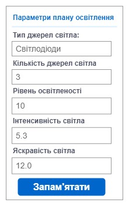
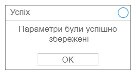

|NFR ID|TC ID|Опис кроків тестового сценарію|Опис очікуваних результатів|
|:-----:|:-----:|:-----|:-----:|
|FR2.5|TC 1.8|Початкові умови: відсутні  Кроки сценарію: відсутні|Екрана форма: |
|FR2.5|TC 1.9|Початкові умови: успішно пройдено TC1.8   Кроки сценарію:  Тип джерел світла = Світлодіоди  Кількість джерел світла = 3 Рівень освітленості = 10   Інтенсивність світла = 5.3   Яскравість світла = 12.0|Екрана форма: |
|FR2.5|TC 1.10|Початкові умови: успішно пройдено TC1.8   Кроки сценарію: Натиснути кнопку "Запам'ятати"|Екрана форма: |
